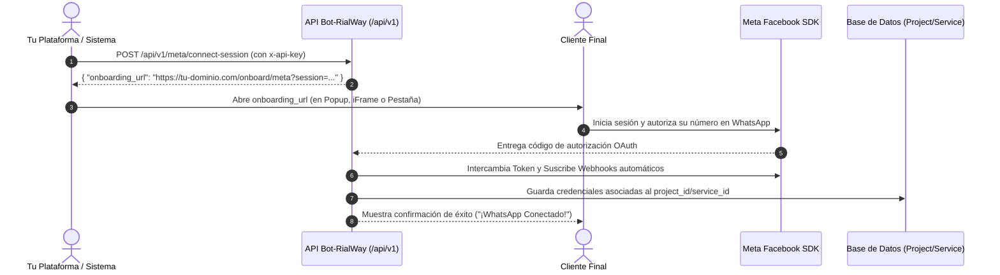

# <i class="fas fa-plug"></i> Guía de Conexión de WhatsApp Business (Meta Embedded Signup API)

Esta API permite a cualquier plataforma externa, panel de administración o CRM de terceros iniciar y completar el **Onboarding oficial de Meta (WhatsApp Business Cloud API)** para sus clientes de forma 100% autónoma, segura y en marca blanca, **sin necesidad de ingresar al CRM ni depender de páginas externas**.

---

## 🚀 Flujo de Integración



---

## 🔐 1. Autenticación

Todas las solicitudes a `/api/v1/*` requieren tu `API_KEY` (configurada en tu proyecto/servicio).

Puedes enviarla de cualquiera de las siguientes 3 formas:
1. **Header HTTP** (Recomendado): `x-api-key: TU_API_KEY`
2. **Bearer Token**: `Authorization: Bearer TU_API_KEY`
3. **Cuerpo del JSON**: `{ "api_key": "TU_API_KEY" }`

---

## 📡 2. Generar Sesión de Onboarding

Genera un enlace seguro de un solo uso (válido por 15 minutos) que contiene la interfaz web con el SDK de Meta para que tu cliente vincule su WhatsApp.

- **Método**: `POST`
- **Endpoint**: `/api/v1/meta/connect-session` (o alias `/api/v1/connect`)

### Solicitud (Request):
```http
POST /api/v1/meta/connect-session HTTP/1.1
Host: tu-dominio.com
x-api-key: TU_API_KEY
Content-Type: application/json

{
    "service_id": "mi_servicio_1" // Opcional si usas el servicio por defecto
}
```

### Respuesta Exitosa (`200 OK`):
```json
{
    "success": true,
    "onboarding_url": "https://tu-dominio.com/onboard/meta?session=9f8c7b6a5e4d3c2b1a0f9e8d7c6b5a4e3d2c1b0a9f8e7d6c5b4a3e2d1c0b",
    "session_token": "9f8c7b6a5e4d3c2b1a0f9e8d7c6b5a4e3d2c1b0a9f8e7d6c5b4a3e2d1c0b",
    "expires_in_seconds": 900
}
```

---

## 🖥️ 3. Cómo Mostrar la Interfaz a tu Cliente

Tienes tres alternativas para presentar la URL `onboarding_url` a tu cliente:

### Opción A: Abrir en una Ventana Emergente (Popup - Recomendado)
```javascript
function abrirOnboarding(onboardingUrl) {
    const ancho = 600;
    const alto = 800;
    const left = (window.screen.width / 2) - (ancho / 2);
    const top = (window.screen.height / 2) - (alto / 2);

    window.open(
        onboardingUrl,
        'MetaWhatsAppOnboarding',
        `width=${ancho},height=${alto},top=${top},left=${left},scrollbars=yes,status=no,menubar=no`
    );
}
```

### Opción B: Incrustar en un iFrame en tu propio Dashboard
```html
<iframe 
    src="https://tu-dominio.com/onboard/meta?session=..." 
    width="100%" 
    height="750px" 
    frameborder="0"
    allow="camera; microphone; geolocation">
</iframe>
```

### Opción C: Redirección directa o Pestaña Nueva
```javascript
window.open(onboardingUrl, '_blank');
```

---

## 📊 4. Consultar Estado de Conexión

Permite a tu sistema comprobar en cualquier momento si el WhatsApp Business del cliente ya se encuentra conectado y activo.

- **Método**: `GET` o `POST`
- **Endpoint**: `/api/v1/meta/status`

### Solicitud (Request):
```http
GET /api/v1/meta/status HTTP/1.1
Host: tu-dominio.com
x-api-key: TU_API_KEY
```

### Respuesta Exitosa (`200 OK`):
```json
{
    "success": true,
    "connected": true,
    "data": {
        "waba_id": "123456789012345",
        "phone_number_id": "987654321098765",
        "verified_name": "Mi Empresa Oficial",
        "updated_at": "2026-08-19T21:00:00.000Z"
    }
}
```

Si aún no ha conectado su número:
```json
{
    "success": true,
    "connected": false,
    "message": "No hay credenciales de Meta registradas para este servicio."
}
```

---

## 💻 5. Ejemplos de Código para Integración

### Node.js / JavaScript
```javascript
const axios = require('axios');

async function obtenerUrlConexion() {
    try {
        const respuesta = await axios.post('https://tu-dominio.com/api/v1/meta/connect-session', {}, {
            headers: {
                'x-api-key': 'TU_API_KEY',
                'Content-Type': 'application/json'
            }
        });

        console.log('URL de conexión:', respuesta.data.onboarding_url);
        // Abrir popup o redirigir usuario
        return respuesta.data.onboarding_url;
    } catch (error) {
        console.error('Error generando sesión:', error.response?.data || error.message);
    }
}
```

### Python
```python
import requests

url = "https://tu-dominio.com/api/v1/meta/connect-session"
headers = {
    "x-api-key": "TU_API_KEY",
    "Content-Type": "application/json"
}

response = requests.post(url, headers=headers, json={})
if response.status_code == 200:
    data = response.json()
    print("URL para tu cliente:", data["onboarding_url"])
else:
    print("Error:", response.text)
```

### PHP (cURL)
```php
<?php
$curl = curl_init();

curl_setopt_array($curl, array(
  CURLOPT_URL => 'https://tu-dominio.com/api/v1/meta/connect-session',
  CURLOPT_RETURNTRANSFER => true,
  CURLOPT_CUSTOMREQUEST => 'POST',
  CURLOPT_POSTFIELDS => '{}',
  CURLOPT_HTTPHEADER => array(
    'x-api-key: TU_API_KEY',
    'Content-Type: application/json'
  ),
));

$response = curl_exec($curl);
curl_close($curl);

$json = json_decode($response, true);
echo "URL de Onboarding: " . $json['onboarding_url'];
?>
```

### cURL (Línea de comandos)
```bash
curl -X POST https://tu-dominio.com/api/v1/meta/connect-session \
  -H "x-api-key: TU_API_KEY" \
  -H "Content-Type: application/json" \
  -d '{}'
```

---

## 🛠️ 6. Qué hace el sistema automáticamente tras la conexión

Una vez que el usuario final autoriza su número en el popup de Meta:
1. **Intercambio seguro de tokens**: El backend intercambia automáticamente el código OAuth temporal por un *Access Token de Larga Duración* (permanente).
2. **Suscripción de Webhooks**: Se suscribe la cuenta comercial (WABA) a los eventos `messages` y `smb_message_echoes` (para sincronizar mensajes entrantes y respuestas manuales).
3. **Persistencia por project_id/service_id**: Las credenciales (`waba_id`, `phone_number_id`, `access_token`) se guardan aisladas en Supabase bajo el `project_id` y `service_id` correspondiente.
4. **Activación Inmediata**: El motor de mensajería queda operativo y listo para recibir y enviar mensajes y plantillas mediante las APIs de RialWay.
